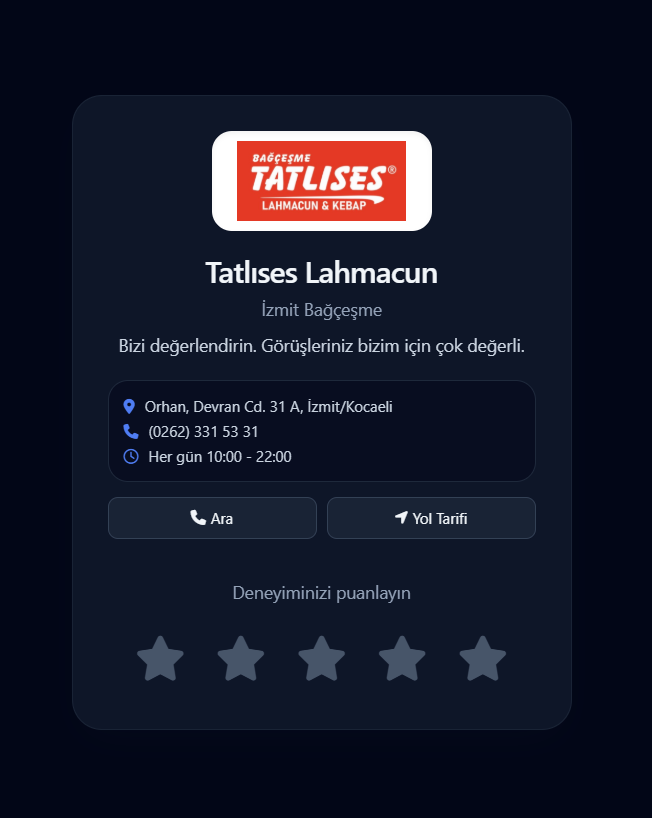

# Local Business QR Feedback Page

QR kod ile acilan, restoran/musteri geri bildirim toplama odakli tek sayfa bir web arayuzu.

## Ozellikler

- Mobil uyumlu ve hizli acilan tek sayfa arayuz
- 1-5 yildiz puanlama akisi
- 4-5 yildizda Google yorumuna yonlendirme ve yorum metnini panoya kopyalama
- Dusuk puanlarda Formspree uzerinden dogrudan geri bildirim gonderimi
- Basarili aksiyonlarda tesekkur/indirim mesaji ve konfeti efekti

## Teknolojiler

- HTML5
- Tailwind CSS (CDN)
- Vanilla JavaScript
- Font Awesome
- Formspree (webhook/form endpoint)

## Kurulum ve Calistirma

1. Projeyi indir:
   - `git clone <repo-url>`
2. Proje klasorune gir:
   - `cd localbusiness-qr`
3. `index.html` dosyasini tarayicida ac.

Not: Lokal gelistirme icin VS Code Live Server gibi bir eklenti de kullanabilirsin.

## Yapilandirma

`index.html` icinde su degerleri kendi isletmene gore guncelle:

- `googlePlaceId`
- `ownerWebhookUrl` (Formspree endpoint)
- Isletme adi, adres, telefon ve calisma saatleri

## Uygulama Gorseli

Asagidaki satirda `assets/app-preview.png` dosyasini kullanacak sekilde yer ayrildi.  
Ekran goruntusunu bu yola ekledikten sonra README'de otomatik gorunecektir.

## Lisans

Bu proje [MIT](./LICENSE) lisansi ile lisanslanmistir.
